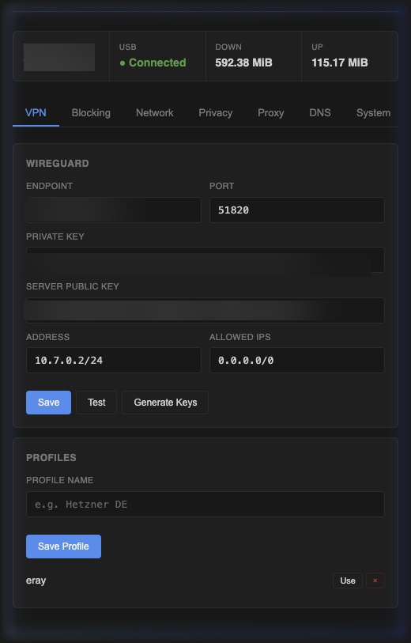
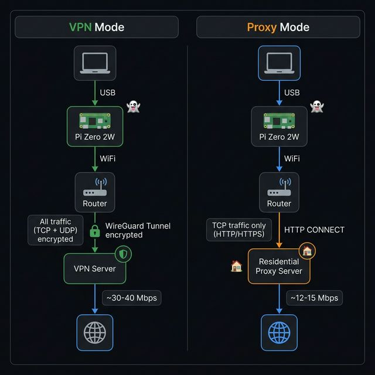

<p align="center">
  
</p>

<h1 align="center"> shadowplug</h1>

<p align="center">
  <b>Plug & play USB privacy dongle, powered by Raspberry Pi Zero 2 W.</b><br>
  No apps. No drivers. Just plug it in, turn off WiFi, and browse anonymously through VPN or residential proxy.
</p>

<p align="center">
  
  
  
  
  
</p>


## ✨ Features

| Feature | Description |
|---------|-------------|
| ⌁ **Plug & Play** | Auto-detected as Ethernet on Windows (RNDIS) and macOS (ECM) |
| 🛡️ **WireGuard VPN** | Fast, modern VPN with multi-profile support |
| 🌍 **Residential Proxy** | Transparent proxy through residential IPs with SNI extraction |
| 🚫 **Ad & Tracker Blocking** | DNS-level blocking (StevenBlack, AdAway, malware lists) |
| 🔀 **Split Tunneling** | Route specific IPs outside the VPN |
| 🎲 **MAC Randomization** | WiFi MAC auto-changes on each boot. Manual change from dashboard too |
| 📊 **Bandwidth Monitor** | Real-time transfer stats and speed measurement |
| 🔒 **Leak Protection** | DNS leak prevention, WebRTC blocking, kill switch |
| 🌐 **DNS Management** | Google, Cloudflare, Quad9 presets or custom servers |
| 🖥️ **Web Dashboard** | Manage everything from `192.168.7.1` |

### Software VPN vs ShadowPlug

| | Software VPN | ShadowPlug |
|---|---|---|
| **Installation** | App on every device | Plug in USB, done |
| **Scope** | Per-app or per-device | All traffic, OS-level |
| **Leak risk** | App crash = IP exposed | Hardware-level, no leaks |
| **Detection** | VPN process detectable | Invisible to OS |
| **Portability** | Tied to device install | Carry between any computer |
| **Ad blocking** | Separate tool needed | Built in |
| **Residential proxy** | Not available | Built-in rotation |
| **Kill switch** | Software-based, can fail | Network-level, always on |
| **Speed** | Full speed | ~30-40 Mbps VPN / ~12-15 Mbps proxy |

> 💡 **Speed note:** The Pi Zero 2 W uses USB 2.0. In real-world tests, WireGuard VPN reaches ~30-40 Mbps (datacenter IP) and residential proxy ~12-15 Mbps (ISP routing overhead). More than enough for web browsing, video calls, and standard streaming.

## 🧰 Requirements

### Hardware
- Raspberry Pi Zero 2 W
- microSD card (4 GB+)
- USB cable:
  - Windows: micro-USB → USB-A
  - Mac: micro-USB → USB-C (direct cable, not adapter)

### Software
- [OpenWrt 25.x](https://firmware-selector.openwrt.org/?version=SNAPSHOT&target=bcm27xx%2Fbcm2710&id=rpi-3) (bcm2710 image for Pi Zero 2 W)

### VPN Server
A server running WireGuard is required. Any VPS provider works (Hetzner, DigitalOcean, Vultr, etc.) or any WireGuard-compatible commercial VPN.

### Residential Proxy *(optional)*

For residential IP masking, you'll need a proxy service that supports HTTP CONNECT with authentication. Works with any compatible provider.


## 🚀 Quick Start

### 1. Flash OpenWrt to SD Card

Download the [Raspberry Pi Zero 2 W image](https://firmware-selector.openwrt.org/?target=bcm27xx%2Fbcm2710&id=rpi-3) and flash it:

```bash
gunzip -c openwrt-*.img.gz | sudo dd of=/dev/sdX bs=4M status=progress
```

### 2. SSH in and Run the Installer

```bash
ssh root@192.168.1.1
wget -O- https://raw.githubusercontent.com/erayerturk/shadowplug/main/setup/install.sh | sh
```

The script will guide you through everything interactively:

```
⌁ shadowplug Installer

[1/8] WiFi Setup
  WiFi SSID: MyHomeWiFi
  WiFi Password: supersecret123
  Connected!

[2/8] Installing packages...
[3/8] Installing Python dependencies...
[4/8] Setting up USB gadget...
[5/8] Configuring network...
[6/8] Configuring firewall...

[7/8] Setting up WireGuard...
  Your Pi's public key (add this to your VPN server):
  aBcDeFgHiJkLmNoPqRsTuVwXyZ1234567890abcdefg=

Configure VPN server now? (y/n): y
  Server IP: 49.13.x.x
  Server Port [51820]: 51820
  Server Public Key: xYzAbCdEfGhIjKlMnOpQrStUvWxYz1234567890xyz=
  Client Address [10.7.0.2/24]: 10.7.0.2/24
  VPN configured!

[8/8] Setting up ShadowPlug web UI...

  ✅ Installation complete!

  1. Plug the Pi into your computer via USB
  2. Open http://192.168.7.1
  3. Configure your VPN server
```

### 3. Use It

1. Plug the Pi into your computer via USB
2. **Turn off WiFi** on your computer
3. Open `http://192.168.7.1` and configure VPN or proxy
4. Verify: `curl ifconfig.me` should show your VPN/proxy IP

<details>
<summary>Need a VPN server? Run this on any VPS</summary>

```bash
wget -O- https://raw.githubusercontent.com/erayerturk/shadowplug/main/setup/server-setup.sh | sudo sh
```

</details>


## 🏗️ Architecture

<p align="center">
  
</p>

### Project Structure

```
shadowplug/
├── README.md
├── setup/
│   ├── install.sh               # Pi-side automated installer
│   ├── server-setup.sh          # VPN server setup script
│   └── configs/
│       ├── usb-gadget           # USB RNDIS+ECM composite init
│       ├── wg0.conf.template    # WireGuard config template
│       ├── hotplug-usb-ip       # Carrier-based IP assignment
│       └── shadowplug-service  # Web UI init script
└── web/
    ├── app.py                   # Flask API backend
    ├── proxy_server.py          # Transparent proxy engine
    ├── requirements.txt
    └── static/
        ├── index.html           # Dashboard SPA
        ├── style.css            # Dark theme
        └── app.js               # Frontend logic
```

### Transparent Proxy Flow

```
Mac/PC TCP traffic
  → iptables PREROUTING (REDIRECT to :12345)
    → proxy_server.py
      → SO_ORIGINAL_DST (recovers real destination IP)
      → TLS Client Hello SNI extraction (recovers domain name)
      → HTTP CONNECT with auth to upstream proxy
        → Residential proxy exit
```

- **QUIC (UDP 443)** is automatically blocked to force browsers to use TCP
- **DNS** is served by the Pi's local dnsmasq with MASQUERADE for upstream
- **No redsocks** - direct kernel-to-Python socket handoff via `SO_ORIGINAL_DST`


## 🖥️ Dashboard

| Tab | Description |
|-----|-------------|
| **VPN** | WireGuard config, key generation, connection test, profile switching |
| **Blocking** | DNS-level ad/tracker/malware blocking with custom domains |
| **Network** | MAC randomization, bandwidth stats, split tunneling, firewall |
| **Privacy** | DNS leak protection, WebRTC blocking, kill switch |
| **Proxy** | Residential proxy config and transparent proxy management |
| **DNS** | DNS server settings with quick presets |
| **System** | CPU temperature, RAM, load average, reboot |


## 🔧 Troubleshooting

| Issue | Solution |
|-------|----------|
| Windows: Unknown device | Device Manager → Update driver → Network → Microsoft → Remote NDIS |
| Mac: No ethernet appearing | Use a direct micro-USB → USB-C cable (not via adapter) |
| Can't access dashboard | Check if Flask is running: `ps \| grep python` |
| VPN not connecting | Verify keys match on both server and Pi |
| Blocking not working | Restart dnsmasq: `/etc/init.d/dnsmasq restart` |
| Proxy: still seeing VPN IP | Restart Chrome (clears QUIC cache) after enabling proxy |
| Proxy: 403 Forbidden | Some non-standard ports (8080, etc.) are blocked by residential proxies |
| No internet with WiFi off | Verify DHCP DNS is set to `192.168.7.1` |


## 📬 Contact

Questions, feedback, or collaboration: **contact@erayerturk.com**

## 📄 License

MIT
